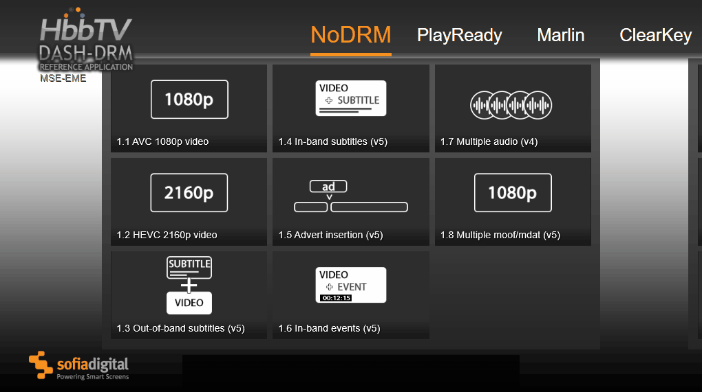
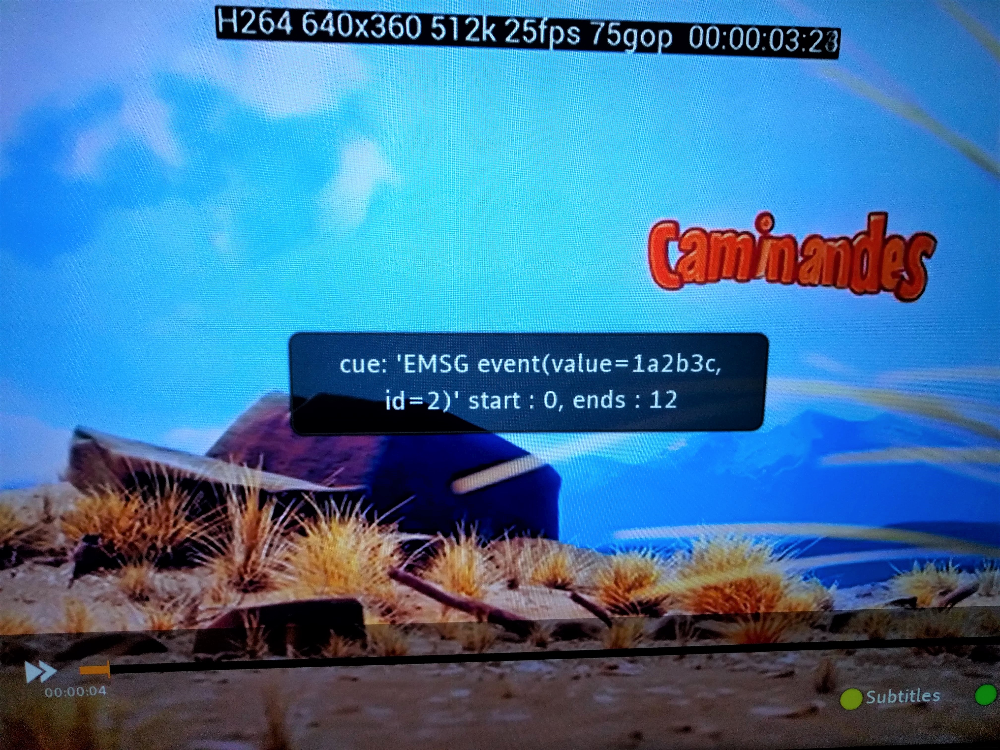

# RefApp
RefApp is an application that allows test engineers to test online video streaming on HbbTV platforms. RefApp is being continuously maintained and developed, therefore there might be differing results on some platforms between different RefApp versions.
## Walkthrough
### General information
RefApp will open on the *NoDRM* category on startup.

While navigating within the app, information about each video should be displayed on the bottom of the screen.

<!---  --->

Immediately after opening a video stream, the player (progress bar with controls) should be visible for a few seconds. Throughout the video, there should be a top bar visible with relevant information about the currently streamed video.

<!---  --->

### Subtitled streams
RefApp offers a wide range of streams to test hardware capabilities, including support for out-of-band- and in-band subtitles.

Switching between subtitle languages is supported and can be performed via pressing the *yellow* button.

<!---  --->

For example, after switching the language from English to Finnish, special characters and how they are displayed should be performed every 10 seconds.

### Ad-insertion

Advert insertion testing is also supported by RefApp. This includes testing of pre- and mid-rolls. Launching the "Advert insertion" test should immediately launch an advert of 5, 15 or 30 seconds long. While the advert is playing, the background should be orange, a frame count should be sliding from side to side and a series of beeping sounds should be audible. 

### In-band events

The "In-band events" test currently should display a box containing relevant information about the event. During the test there should be the following events:
* Start:  0, Ends: 12
* Start: 24, Ends: 36
* Start: 54, Ends: 66

### Engineer view

RefApp offers an engineer view with console output that can be utilized in real-time. The view can be accessed via pressing the *blue* button while the app is open.

<!---  --->

The engineer view helps debugging and offers relevant information about key presses and the current state of the stream.

### Live

RefApp also supports live-stream testing with a variety of live-streams. Note that currently there are *NoDRM-*, *PlayReady-*, and *Marlin* streams available.

While a live-stream is playing, there should be the *LIVE* indicator on the right of the progression bar.

<!---  --->

### Settings

RefApp allows configuration to some extent. Currently the HbbTV mode can be set to either 1.5 or 2.0.1. RefApp also offers tools to delete cookies as well as save console logs.

